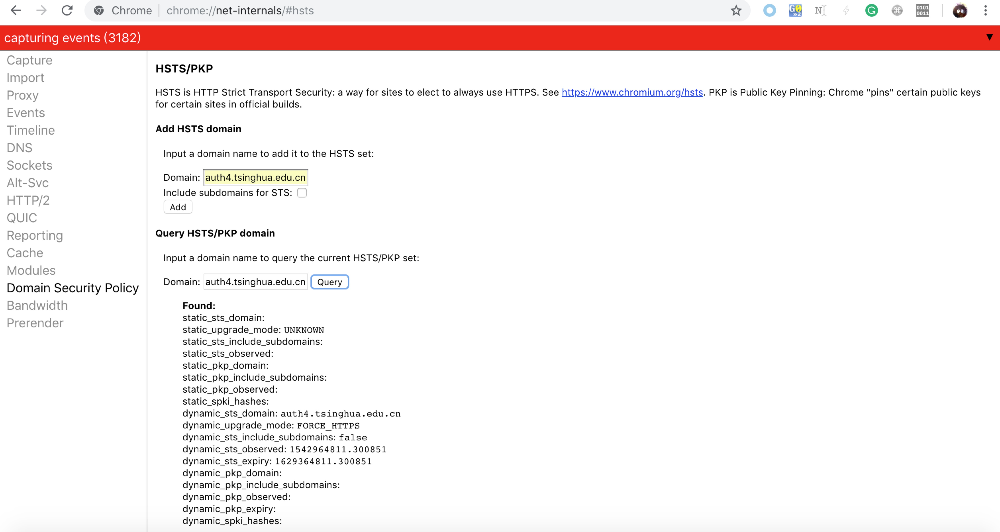

# 小作业：Linux 系统口令破解

- 2016010981 陈晟祺：借用实验室高端显卡服务器，并运行命令进行破解
- 2015011278 谭闻德：查阅破解方法以及 hashcat 使用方式

shadow 文件记录：

```
test:$6$dRf2Gldj$W4DfAK9vGyz9XCCJrsPOtR7tgf3q6lDH92kE2WKHNXZHfmu7dKFgo5M72jrL2hXJjxcdg596WsWPYYgGrmPZp1:17107:0:99999:7:::
```

已知：密码为 5 位 ASCII 字符。

查阅 Linux shadow 文件记录格式，知该口令为加盐的 SHA512 散列值。

破解命令：

```bash
echo '$6$dRf2Gldj$W4DfAK9vGyz9XCCJrsPOtR7tgf3q6lDH92kE2WKHNXZHfmu7dKFgo5M72jrL2hXJjxcdg596WsWPYYgGrmPZp1' > test.shadow
hashcat -O -m 1800 -a 3 test.shadow "?a?a?a?a?a"
```

借用实验室高端显卡服务器破解，并得到结果如下：


可知密码为“tls13”。

值得一提的是，谭闻德同学曾尝试使用自己可怜的笔记本电脑进行破解，速度仅有 165H/s，是上述服务器的千分之一，hashcat 报告预估时间需要一年零二百天。

# 实验四：清华校园网身份认证及单点登录安全分析

- 2016010981 陈晟祺：分析部分校内站点的默认登录方式、逆向准入认证系统加密算法、检测校外网络访问认证系统的 XSS 漏洞、撰写并修改实验报告
- 2015011278 谭闻德：分析部分校内站点的默认登录方式、逆向准入认证系统加密算法、参与研究校外网络访问认证客户端自动更新的漏洞、撰写并修改实验报告

## 概述

本实验分析了清华大学校园网身份认证站点（包括校外网络访问认证 net、准入认证 auth4、auth6 以及 auth）以及其他常用校内信息系统的认证方式，讨论了这些认证方式的安全性。

## 实验方法

本实验对于每个校园网身份认证站点（包括校外网络访问认证 net、准入认证 auth4、auth6 以及 auth）以及其他常用校内信息系统站点，分析其**默认**登录方式，检测其是否使用清华大学用户电子身份统一认证凭据（以下简称“使用统一凭据”），以及检测其是否跳转到统一认证系统（id.tsinghua.edu.cn）进行认证（以下简称“跳转”）。

特别地，使用统一认证但没有跳转到统一认证系统进行认证，则说明该站点可能在后台与统一认证系统交互。

本实验将上文提到的登录方式的安全性从高到低按如下顺序排列，并认为同一大类安全性相同：

* id. 跳转到 HTTPS 的统一认证系统（https://id.tsinghua.edu.cn）进行认证
   * before. POST 认证凭据前进行跳转，即用户在统一认证系统提供的表单内填写凭据
   * after. POST 认证凭据到统一认证系统
   * self. 该站点是统一认证系统本身
* https. HTTPS 类
   * post. POST 类
      * plain. 明文 POST 密码
      * hash. 明文 POST 密码的 MD5 或 SHA1 等散列值或消息认证码
      * known_key. POST 密码对称加密后的密文，但对称加密密钥明文传输
* http. HTTP 类
   * post. POST 类
      * plain. 明文 POST 密码
      * hash. 明文 POST 密码的 MD5 或 SHA1 等散列值或消息认证码
      * known_key. POST 密码对称加密后的密文，但对称加密密钥明文传输

*注1：由于站点接收到用户凭据后可能使用不安全的内部通信将该凭据转发至核心认证服务器，因此本节将 id 的安全性认定为比 https 高。*

*注2：https.post.known_key 的详细解释请见附录1。*

## 实验结果

| 名称             | 子域名（.tsinghua.edu.cn）| 认证方式 | 是否使用统一凭据 | 备注                       |
| ---------------- | -------------------------- | ---- | ---------------- | -------------------------- |
| 统一认证系统 | id | id.self | 是 |  |
| 校外网络访问认证 | net                        | http.post.hash | 是 |  |
| 校园网自服务系统 | usereg                     | http.post.hash | 是 |  |
| 准入认证         | auth, auth6         | https.post.known_key | 是      |这两个站点使用同样认证方式|
| 准入认证（IPv4） | auth4 | http.post.known_key | 是 |  |
| 信息门户 | info | https.post.plain | 是 |HTTP 嵌入 HTTPS 表单|
| 教学门户 | academic | https.post.plain | 是 |HTTP 嵌入 HTTPS 表单|
| 网络学堂 | learn | https.post.plain | 是 |HTTP 嵌入 HTTPS 表单|
| 网络学堂（2015） | learn.cic | id.after | 是 |HTTP 嵌入 HTTPS 表单|
| 网络学堂（2018） | learn2018 | id.after | 是 |HTTP 嵌入 HTTPS 表单|
| 云盘 | cloud | id.before | 是 |  |
| Git | git | id.before | 是 |  |
| 电子邮箱（学生版） | mails | https.post.plain | 是 |HTTP 嵌入 HTTPS 表单|
| 电子邮箱（教工版） | mail | https.post.plain | 是 |HTTP 嵌入 HTTPS 表单|
| 信息化用户服务平台 | its | http.post.plain | 是 | |
| 体育代表队平台 | sports.student | http.post.plain | 是 | |
| 研读间/研讨间预约系统 | cab.hs.lib | http.post.plain | 是 | |
| 学生清华 | student | id.before | 是 | |
| 第二成绩单 | transcript.student | id.before | 是 | 同“学生清华” |
| 社团协会 | shetuan.student | id.after | 是 | |
| 校园一卡通自助查询系统 | ecard | http.post.plain | 是 | |
| 我们的家园 | myhome | http.post.plain | 否 | |

*注：对于“HTTP 嵌入 HTTPS 表单”，虽然 HTTPS 本身可以被认为是安全的，但由于实验二中描述的攻击方式（降级攻击），在 HTTP 中嵌入 HTTPS 表单会使得安全性有一定程度的下降。*

此外，本实验发现大部分校内常用信息系统站点的 HTTPS 证书使用 Let's Encrypt 签发的通配符证书（Common Name 为 *.tsinghua.edu.cn）。经过进一步调研，包括咨询相关负责人，这些系统本身其实都使用了同一台负载均衡器（F5）进行 HTTPS Offloading，即密钥协商和加解密等计算都在该设备上完成，因此统一使用了一份证书和私钥，便于管理。

同时，本节还注意到校内有大量年久失修的信息系统站点，它们绝大部分都使用 http.post.plain 的登录方式，为避免冗余，这里不一一列出。

本实验还发现了一些有趣的漏洞或者现象，请参阅附录。

## 结束语

本次实验发现有少数站点已经默认启用了 HTTPS，另外一些默认 HTTP 的站点在传输用户凭据时也使用了 HTTPS 表单，可以看出有关维护老师确实付出了一定的心血和成本（注意到 HTTPS 更加消耗服务器的计算资源）。然而，由实验二的结论，整站 HTTPS 或 HSTS 才是相对安全的。最后，还有大部分不常用的隐藏站点使用 HTTP 传递用户凭据，甚至对 HTTPS 没有任何支持。

在与有关维护老师进行友好、愉快的交流后，本节认为当用户基数达到一定规模后，结合一些历史原因，很多工程方面的问题突显出来，很多配置不能像个人网站等小规模网站一样随意部署。

总之，提高我校信息系统的安全水平，任重而道远。

## 附录1 准入认证系统加密算法逆向

上文将准入系统的认证方式认定为“https.post.known_key”或“http.post.known_key”，本节附录进行了进一步的解释。

通过深入分析准入系统前端的 JavaScript 代码，本节发现整个认证过程的本意是一次“挑战—应答”（challenge-response），遗憾的是其在实现方面出了问题。

具体而言，在前端容易观测到准入系统的认证过程如下（去除了无关信息）：

1. 前端向后台服务器请求一个一次性的令牌“token”。
2. 前端将用户提供的明文凭据与一些辅助信息格式化为 `JSON`，使用上一步获得的 token 作为密钥进行加密或散列运算后，编码为 ASCII 字符串，发送到后台服务器。记最终 ASCII 字符串为“info”，加密或散列算法为 E，编码算法为 B。
3. 后台服务器使用 token 和 info 计算认证通过与否，然后反馈给前端。
4. 前端进行进一步处理。

基于 2 和 3，本节猜测算法 E 为可逆的加密算法，否则后台服务器将要明文保存密码。

简单浏览准入系统前端的 JavaScript 代码后，本节发现编码算法 B 采用的函数是 `hashes.min.auth.js` 中的 `Base64.encode()` ，即 Base64 编码。但是将 `hashes.min.auth.js` 与在 GitHub 开源的正版 `hashes.min.auth.js` 比对后，本节发现准入系统将 Base64 编码的字母表由 `ABCDEFGHIJKLMNOPQRSTUVWXYZabcdefghijklmnopqrstuvwxyz0123456789+/=` 改变为 `LVoJPiCN2R8G90yg+hmFHuacZ1OWMnrsSTXkYpUq/3dlbfKwv6xztjI7DeBE45QA=`，试图混淆逆向者。

加密算法 E 使用的函数为 `portal.main.min.js` 中的 `xEncode()`。本节发现，在该文件中，某些常数被拆解为了两个常数的按位或，如 `0x86014019 | 0x183639A0` 或 `0x8CE0D9BF | 0x731F2640`，试图混淆逆向者。其中的大部分，包括`0x8CE0D9BF | 0x731F2640`，在进行常数折叠后结果均为 `0xFFFFFFFF`。用此数做按位与运算，可以将算术运算限制在模 $2^{32}$ 的完全剩余系中，从而正确实现加密算法。剩下一个 `0x86014019 | 0x183639A0` 的结果为 `0x9e3779b9`，这是 TEA（微型加密算法）的一个特征。注意到 TEA 有 XTEA 以及 [XXTEA](https://en.wikipedia.org/wiki/XXTEA) 等变种，经过比对，本节确认算法 E 即为 XXTEA 的加密部分。特别地，加密算法将输入的字节序列视为小端序的 32 位无符号整数序列。若需要，输入的字节序列尾部用零填充。

容易写出算法 B 和算法 E 的逆过程（分别为 `auth_base64.py` 和 `xxtea.py`），从而写出使用 token 和 info 计算明文凭据的算法 `auth_reverse.py`。效果如图所示：


本小节还注意到 IPv4 的准入认证页面会主动将 HTTPS 访问的用户跳转到 HTTP（如下图所示），即开启了强制 HTTP，在不安全的网络环境下，用户的明文凭据更容易被嗅探。


可以用如图所示的方法来缓解：



另外，通过抓取 Windows 版准入认证系统客户端与服务器的通信，本节发现客户端和浏览器的行为是极其类似的，它们发送的内容是一致的，均含有 token 和 info。并且，客户端只使用 HTTP。这表明，用客户端登录准入认证系统也是危险的。

以下是著名安全专家陈晟祺对此的评价：

> “……可以猜想到，写下这些代码的程序员或许以为自己机智过人，更换了编码算法，混淆了加密算法中的常数，就能掩人耳目，不会被轻易破解。这当然是极度可笑的……事实上这与直接发送明文密码没有区别。但如果在全部 HTTPS 的环境下，也无可厚非。最后令我们更为震惊的是，IPv4 的准入认证页面会主动将 HTTPS 访问的用户跳转到 HTTP （见上图）！这就为不怀好意者提供了一个直接获得用户密码的机会（原本的 net 只能获取 MD5）。我们已经上报学校，希望这一严重问题能尽快得到修复……事实上，正确实现的“挑战—应答”模式确实能有效避免重放攻击，同时也不会泄露明文密码。但不幸的是，SRUN 系统的开发者似乎并没有做到这一点……”

谭闻德同学对此表示：
> “我同意陈专家的说法。”

### 可能的修复方式

1. 实现正确的“挑战—应答”模式，但这可能由于数据库中存储的用户凭据的限制而无法实现。或者，强制使用 HTTPS。
2. 对于上述跳转漏洞，跳转时不指定协议，即返回 `Location: //auth4.tsinghua...`。这样允许 HTTPS 访问的用户保持 HTTPS。

## 附录2 校外网络访问认证系统的 XSS 漏洞

该漏洞已有前人发现，本节再次对其进行了测试。

校外网络访问认证系统（net.tsinghua.edu.cn）是绝大部分设备都会用到的系统。作为一个 Captive Portal，它实现了在认证后跳回用户未认证时尝试访问的网页的功能，流程如下：

1. 用户访问 `http://example.com`。
2. 计费网关发现用户未认证，跳转到 `http://net.tsinghua.edu.cn/?url=example.com`。
3. 用户认证成功，跳转到 `http://net.tsinghua.edu.cn/wired/?url=example.com`。
4. 用户被跳转回 `https://example.com`。

其中 4. 在对应页面的 JavaScript 脚本中实现为：

```javascript
dst = $.url().param('url');
if (location) location = dst
```

注意到此处没有对参数进行任何检查。因此，可以用直接的手段进行 XSS 攻击，比如传入 `url=javascript:alert('Hi')`，结果如下：


此外，本节发现校外网络访问认证系统的一个严重设计缺陷也仍未被修复，该缺陷将用户密码明文存储在 Cookie 中。攻击者借助上述 XSS 漏洞，以及该设计缺陷，可以获取用户的敏感信息。攻击者只需要在用户可能访问到的任意网站的页面中嵌入一个（不可见的）  `iframe` 指向此页面，并在链接中嵌入恶意代码，该代码将用户的 Cookie 发送到攻击者控制的服务器即可。一个例子如下：

```html
<iframe src="https://net.tsinghua.edu.cn/wired/?url=javascript:'';" border="0" frameborder="0" width="0" height="0" />
```

借助其他漏洞，此漏洞的危害性将会进一步扩大。例如，2001 版和 2018 版网络学堂的评论区以及提交作业等处均存在多个 XSS 注入点，可以插入任意 HTML 代码。结合上述信息泄露漏洞，受害者查看攻击者的评论或作业，受害者的明文凭据就会立刻被泄露。事实上，2001 版网络学堂的 XSS 漏洞已经存在多年，工程师可能也因为此系统将被弃用而疏于修复，是一个严重的安全隐患。

### 可能的修复方式

1. 过滤 `url`，但难以正确实现。或者，取消自动跳转。
2. 不在 Cookie 中存储用户密码。

## 附录3 校外网络访问认证客户端自动更新协议漏洞

校外网络访问认证系统客户端2015年版本在自动更新时使用 HTTP 协议，并且没有检查任何数字签名。此外，客户端运行时要求 Windows 管理员权限。这使得攻击者在其可以控制的网络环境下，能够通过伪造更新服务器返回虚假更新响应给客户端，来使得客户端执行攻击者的代码。

请参阅徐子涵组的实验成果。

