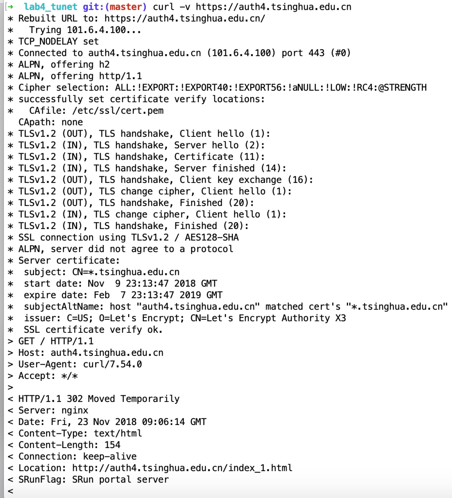

# 实验四：清华校园网身份认证及单点登录安全分析

- 2016010981 陈晟祺：超级大腿
- 2015011278 谭闻德：大腿

## 概述

本实验分析了清华大学校园网身份认证站点（包括校外网络访问认证 net、准入认证 auth4、auth6 以及 auth）以及其他众多校内信息系统的登录方式，讨论了这些登录方式的安全性。

## 实验方法

本实验对于每个校园网身份认证站点（包括校外网络访问认证 net、准入认证 auth4、auth6 以及 auth）以及其他众多校内信息系统站点，分析其**默认**登录方式，检测其是否使用清华大学用户电子身份统一认证凭据（以下简称“使用统一凭据”），以及检测其是否跳转到统一认证系统（id.tsinghua.edu.cn）进行认证（以下简称“跳转”）。

特别地，使用统一认证且没有跳转到统一认证系统进行认证，则说明该站点完全在后台与统一认证系统交互。

本实验将上文提到的登录方式的安全性从高到低按如下顺序排列，并认为同一大类安全性相同：

* https. HTTPS 类
   * post. POST 类
      * plain. 明文 POST 密码
      * hash. 明文 POST 密码的 MD5 或 SHA1 等散列值或消息认证码
      * known_key. POST 密码对称加密后的密文，但对称加密密钥明文传输
* http. HTTP 类
   * post. POST 类
      * plain. 明文 POST 密码
      * hash. 明文 POST 密码的 MD5 或 SHA1 等散列值或消息认证码
      * known_key. POST 密码对称加密后的密文，但对称加密密钥明文传输

## 实验结果

| 名称             | 子域名（.tsinghua.edu.cn）| 登录方式 | 是否使用统一凭据 | 是否跳转 | 备注                       |
| ---------------- | -------------------------- | ---- | ---------------- | -------- | -------------------------- |
| 校外网络访问认证 | net                        | http.post.hash | 是 | 否 ||
| 准入认证         | auth, auth6         | https.post.known_key | 是      | 否 |这两个站点使用同样认证方式|
| 准入认证（IPv4） | auth4 | http.post.known_key | 是 | 否 ||
| 信息门户 | info | https.post.plain | 是 | 否 |HTTP嵌入HTTPS表单|
| 教学门户 | academic | https.post.plain | 是 | 否 |HTTP嵌入HTTPS表单|
| 网络学堂 | learn | https.post.plain | 是 | 否 |HTTP嵌入HTTPS表单|
| 网络学堂（2015） | learn.cic | https.post.plain | 是 | 是 |HTTP嵌入HTTPS表单|
| 网络学堂（2018） | learn2018 | https.post.plain | 是 | 是 |HTTP嵌入HTTPS表单|
| 云盘 | cloud | https.post.plain | 是 | 是 ||
| Git | git | https.post.plain | 是 | 是 ||

## 附录1 准入认证系统加密算法逆向

上文将准入系统的登录方式认定为“https.post.known_key”或“http.post.known_key”，本附录进行了进一步的解释。

通过阅读准入系统网页的 JavaScript 代码，我们可以发现，整个认证过程是一次 challenge-response，步骤如下：

1. 浏览器向服务器请求一个一次性的 token
2. 浏览器将用户提供的凭据（包含明文密码）与一些辅助信息格式化为 `JSON`，使用上一步中的 token 作为密钥进行加密后，编码为 ASCII 字符，发送到服务器端
3. 服务器端使用 token 进行解密、解码，并通过凭据认证用户身份

很容易知道，服务器端进行的编码与加密一定都是可逆的，所以我们对此进行了分析。其中编码采用的函数是 `hashes.min.auth.js` 中的 `Base64.encode()` ，顾名思义就是 Base64 编码，但是字母表从原本的 `ABCD...=` 变化为 `LVoJPiCN2R8G90yg+hmFHuacZ1OWMnrsSTXkYpUq/3dlbfKwv6xztjI7DeBE45QA`。加密使用的函数为 `portal.main.min.js` 中的 `xEncode()` ，初看相当复杂，也有不少奇怪的常数。但我们发现，它只是一种混淆的手段，其中大部分常数在经过计算归约后都是 `0xFFFFFFFF`，起到了模拟 32 位整数溢出的作用。而通过其中一个关键的常数——`0x9e3779b9`，我们找到了其采用的加密算法 [XXTEA](https://en.wikipedia.org/wiki/XXTEA)，经比较，加密逻辑与算法的标准描述毫无区别。因此，只需要按照描述自行撰写解密函数即可。

另外需要注意的是，由于算法是对 32 位无符号数字的运算，因此准入系统在加密前对字符串形式的 JSON 进行了一些预处理，即将长度填充为 4 字节的倍数，每 4 字节整合为一个 32 位无符号整数，在加密再后恢复为字节数组进行编码。因此，在实现逆向操作时，也需要遵守这些流程（反向进行）。

经过实验，我们成功实现了对浏览器发送数据的解密，运行 `auth_reverse.py `即可得到如图结果。其中 `auth_base64.py` 与 `xx_tea.py` 分别是对解码与解密算法的具体实现。

可以猜想到，写下这些代码的程序员或许以为自己机智过人，更换了编码算法，混淆了加密算法中的常数，就能掩人耳目，不会被轻易破解。这当然是可笑的，事实上这与直接发送明文密码没有区别。但如果在全部 HTTPS 的环境下，也无可厚非。但令我们大为震惊的是，`auth4.tsinghua.edu.cn` 会主动将 HTTPS 访问的用户跳转到 HTTP （见下图）！这就为不怀好意者提供了一个直接获得用户密码的机会（原本的 net 只能获取 MD5）。我们已经上报学校，希望这一严重问题能尽快得到修复。

我们并意在否定 challenge-response 的模式，如果实现正确，它能够有效避免重放攻击（正如目前 net 中存在的），同时也不会暴露用户的密码。但不幸的是，SRUN 系统的开发者似乎并没有做到这一点。

## 结束语

