# 实验一：ARP欺骗和IP假冒

2016010981 陈晟祺
2015011278 谭闻德

## 问题1

### 问题环境

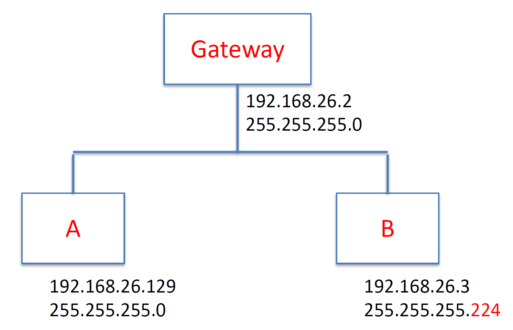

三台主机连接在同一台交换机上，原本都应配置为`192.168.26.0/24`子网，但 B 的掩码错误配置为255.255.255.224（ `/27`子网）。测试在此环境下各主机之间的连通性，并解释原因。

### 实验环境配置

本实验中，三台主机配置为：

| 名称    | MAC               | IP                | 网关           | 操作系统     |
| ------- | ----------------- | ----------------- | -------------- | ------------ |
| Gateway | 00:50:56:3a:80:9a | 192.168.26.2/24   | （上联互联网） | Ubuntu 16.04 |
| A       | 00:50:56:29:39:fa | 192.168.26.129/24 | 192.168.26.2   | Windows 10   |
| B       | 00:50:56:38:26:96 | 192.168.26.3/27   | 192.168.26.2   | Windows XP   |

配置后，A、B均可以通过网关正常访问互联网，如图所示。

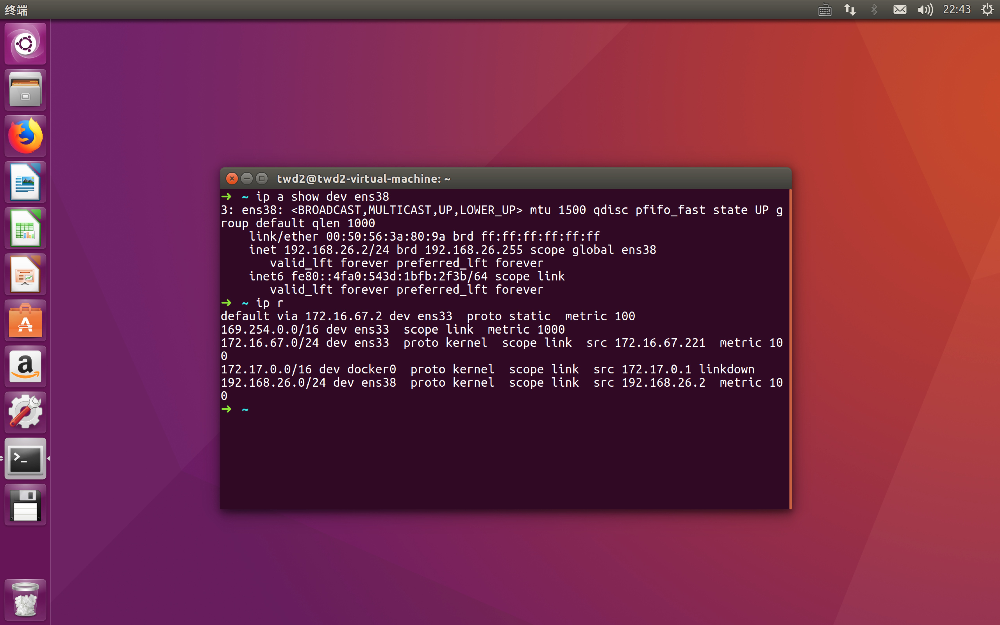
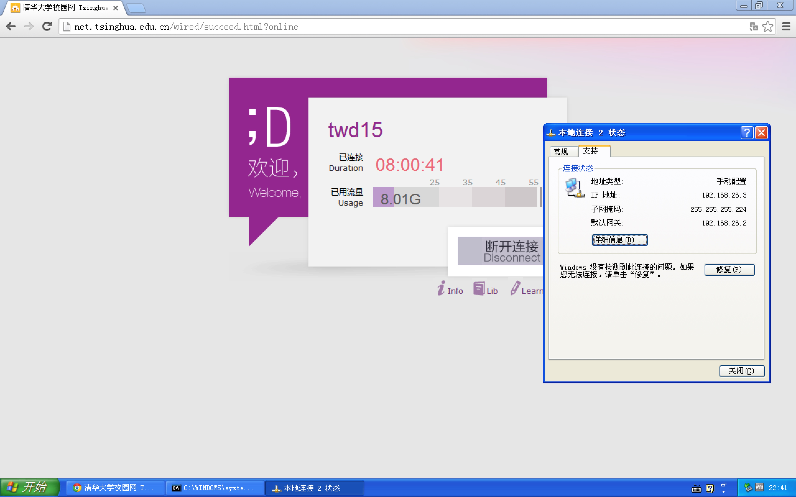
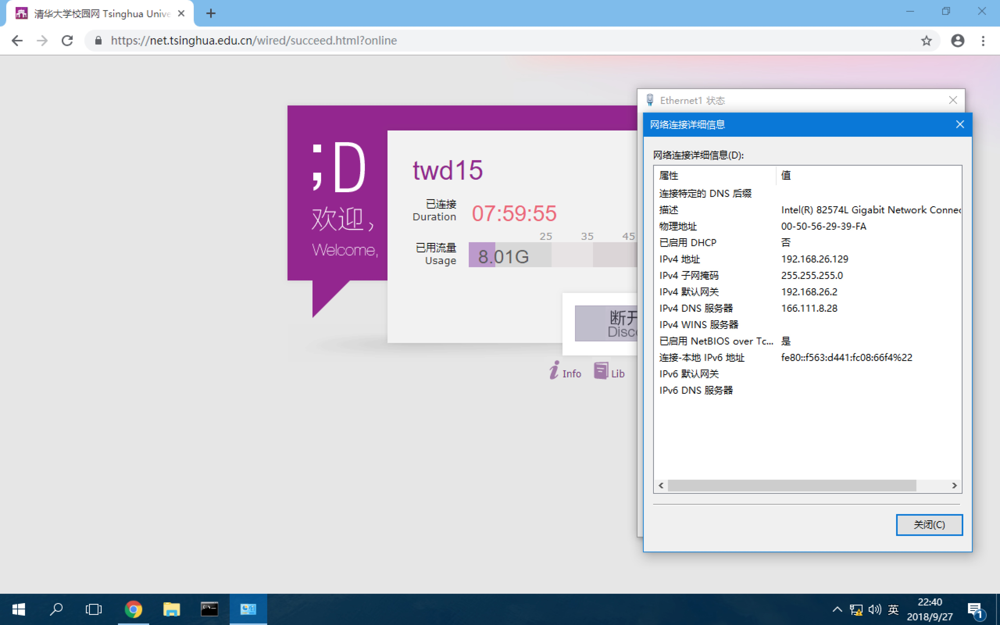

### 连通性测试：从网关

首先从网关 ping A 与 B，连通性都没有问题。这是由于网关与 A/B 分别都在同一广播域中，所以它们都能够直接与网关通信。此部分无需过多的解释。ARP与ICMP流量也是平凡的。

### 连通性测试：从 A

从 A 分别 ping 网关与 B，都能联通。如图：

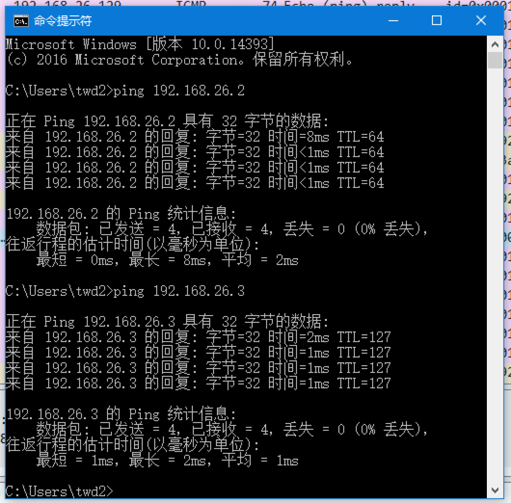

注意到，B 的回复 TTL 少了1，这说明回复经过了网关，而不是直接从 B 而来。从 A 上抓包，得到如下流量：

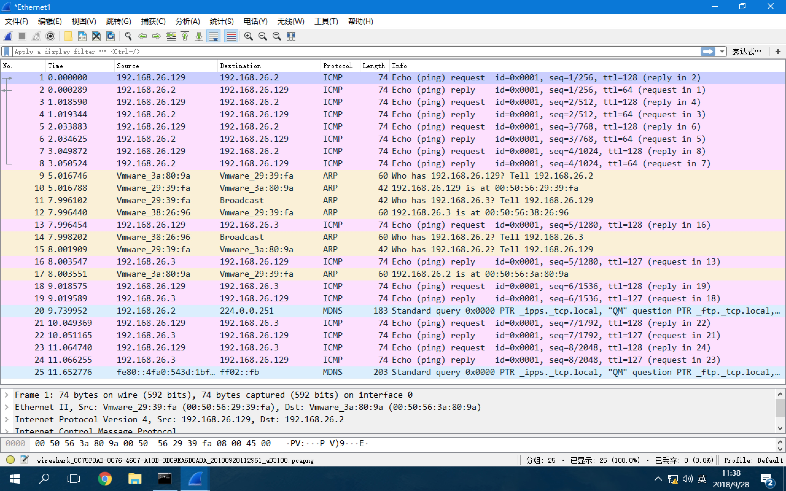

上半部分是正常的与网关进行 ping，下半部分是 ping B。可以看到，从 A 的角度，除了 TTL 以外并没有任何异样。

在 B 上抓包，得到如下流量：

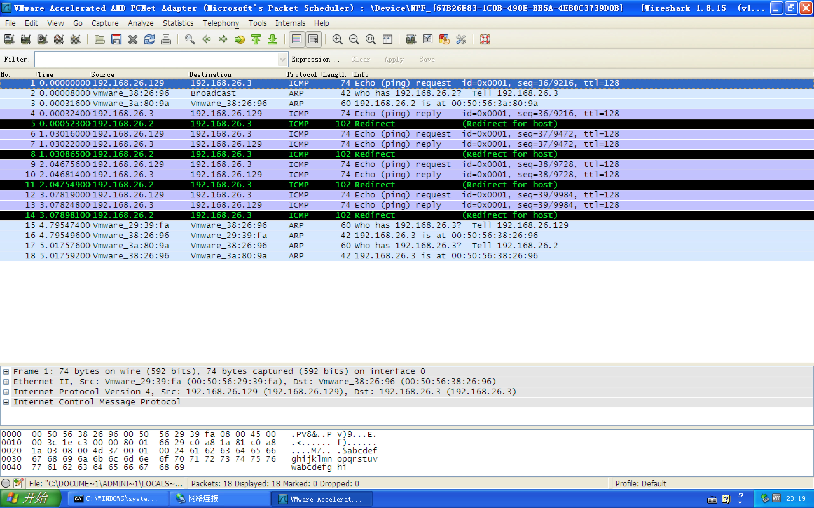

可以看到 B 按照配置，将回复包发送给了网关。网关发现这些包的出入 interface 是相同的（并无法意识到 B 的错误配置），向 B 发送了 `ICMP Redirect`，提醒 B 有到 A 更短的路径。

### 连通性测试：从 B

从 B 分别 ping 网关与 A，都能联通。如图：

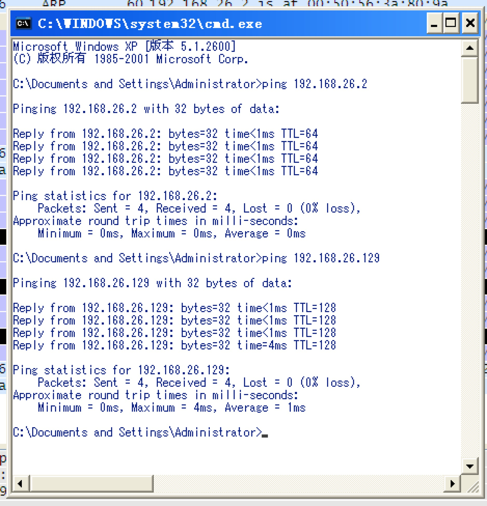

观察回复的 TTL，可以看出网关与 A 都是直接从链路回复了 B。

在 A 上抓包，能看到从 B 发来的包 TTL - 1，的确是经过了网关，如下：

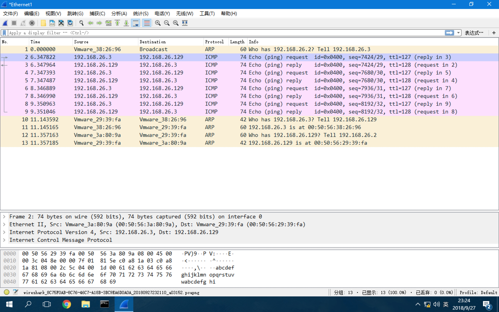

在 B 上抓包，观察如下：

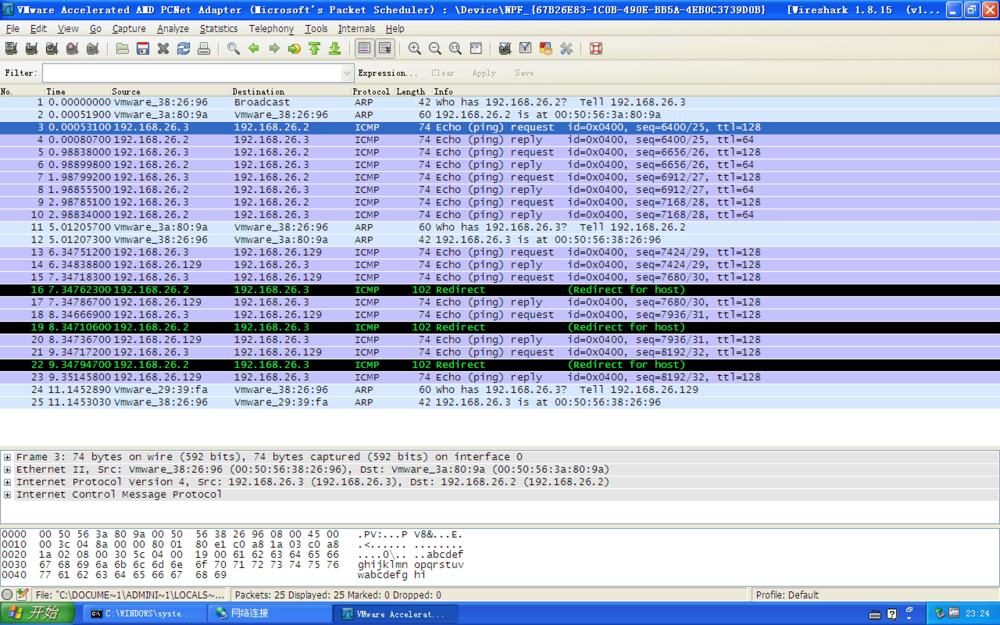

这也是预期的：其与网关是直连的，而到 A 的 ICMP 包发送给了网关（截图中被选中包的目标 MAC 地址即为网关），而回复包直接由 A 从链路上发来。这里网关依旧给 B 发送了 `ICMP Redirect` 的提醒。

### 连通性测试：网关关闭

在网关关闭的情况下，A 与 B 之间互相均不能 ping 通，根本原因是 B 无法与 A 直接在链路上通信。

如 ping 是 A 发起的，在 B 上可以观察到 request 流量，但是 B 由于无法得到网关的 ARP 回应，所以无法发出回包，如图：

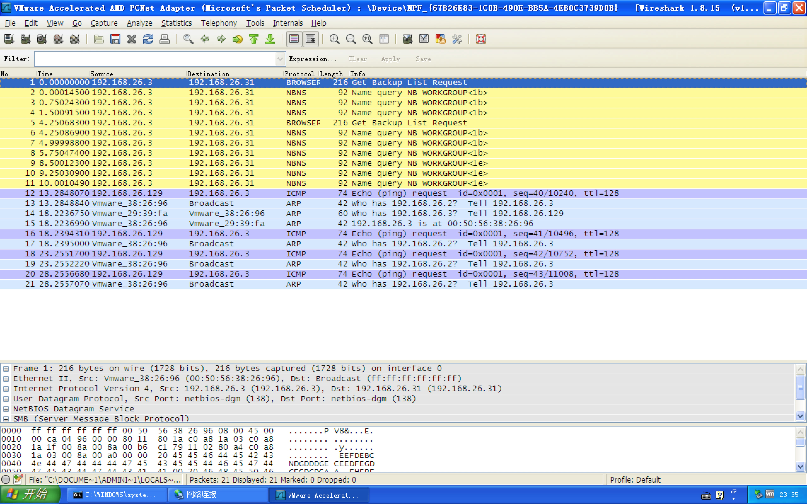

如 ping 是 B 发起的，则 B 根本无法发出 ICMP 包，只是不停进行 ARP 询问，在 A 与 B 上都能抓到 B 询问网关 MAC 的 ARP 包，如图：

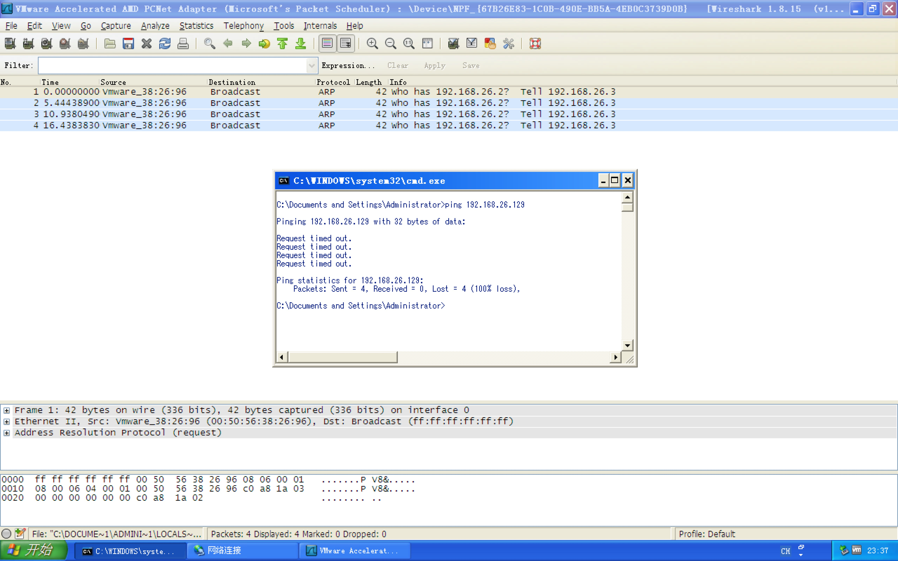

### 说明与总结

本实验中的 ARP 流量都是正常的，即 A 和网关由于正确配置了掩码，它们都会对其余 IP 直接发送 ARP 询问以进行直接的链路通信。而 B 能回复它们的询问，但由于其认为自己与 A 并不在同一个广播域中，故其不会主动询问 A 的 MAC，而是选择询问网关 MAC 后交给网关处理。在网关正常工作的情况下，A 与 B 能够进行三层的通信，但不能进行二层的通信（因为B只能收到不能回复）。

## 问题2