# 实验一：ARP欺骗和IP假冒

* 2016010981 陈晟祺：进行部分实验截图、问题2中被攻击、撰写测试分析报告
* 2015011278 谭闻德：完成问题1操作、进行大部分实验截图、问题2中攻击队友、修改测试分析报告

## 问题1

### 问题环境

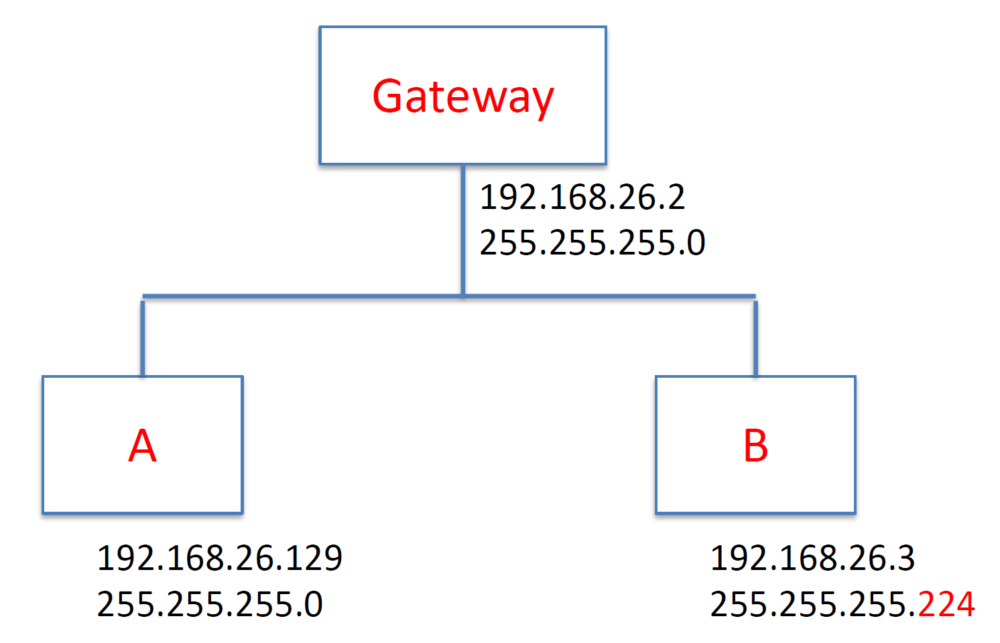

三台主机连接在同一台交换机上，原本都应配置为 `192.168.26.0/24` 子网，但 B 的掩码错误配置为 `255.255.255.224` （ `/27` 子网）。测试在此环境下各主机之间的连通性，并解释原因。

### 实验环境配置

本实验中，三台主机配置为：

| 名称    | MAC               | IP                | 网关           | 操作系统     |
| ------- | ----------------- | ----------------- | -------------- | ------------ |
| Gateway | 00:50:56:3a:80:9a | 192.168.26.2/24   | （上联互联网） | Ubuntu 16.04 |
| A       | 00:50:56:29:39:fa | 192.168.26.129/24 | 192.168.26.2   | Windows 10   |
| B       | 00:50:56:38:26:96 | 192.168.26.3/27   | 192.168.26.2   | Windows XP   |

配置后，A、B 均可以通过网关正常访问互联网，如图所示。

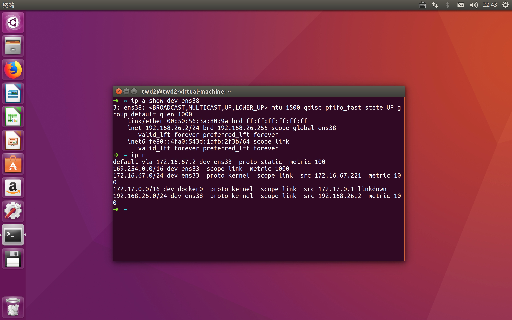
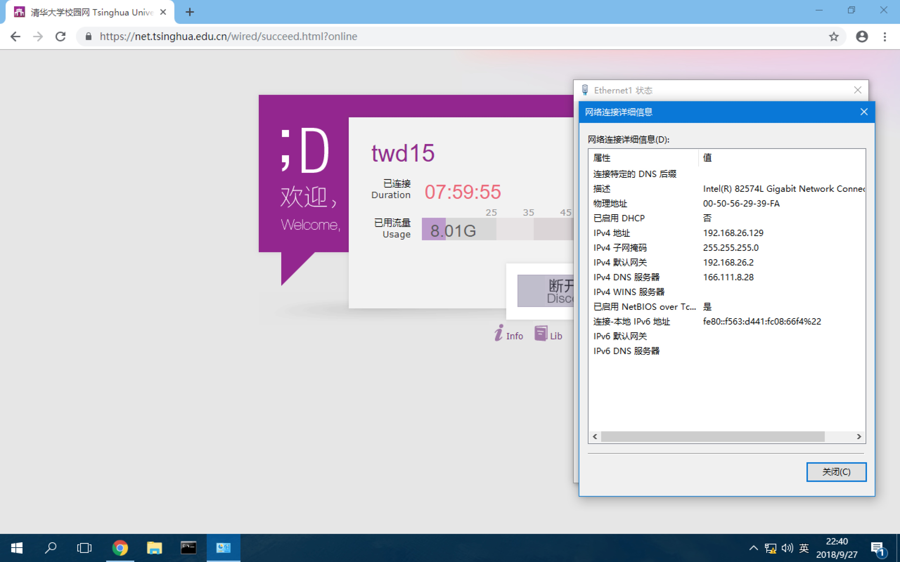


此外，抓包时没有开启混杂模式，即抓包时允许接收目标 MAC 地址与自己的 MAC 地址不同的包。

### 连通性测试：从网关

首先从网关 ping A 与 B，连通性都没有问题。这是由于 A 和 B 与网关分别都在同一子网中，所以它们都能够直接与网关通信。抓包获得的 ARP 与 ICMP 流量也是容易理解的，如下图所示。

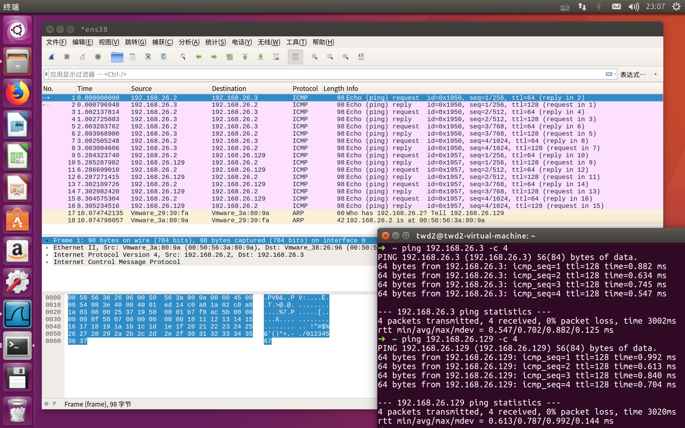

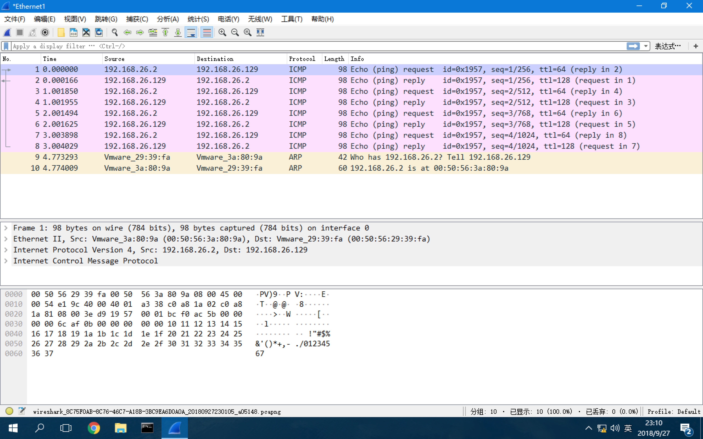

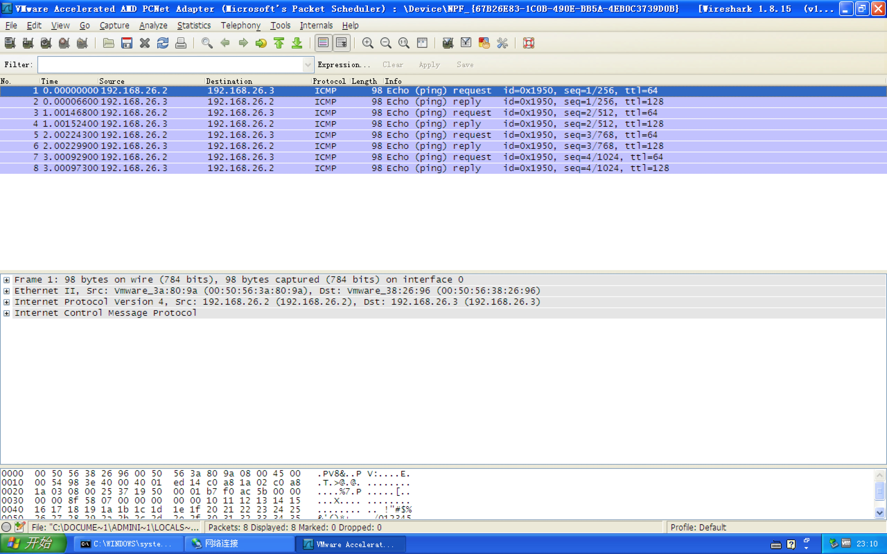

### 连通性测试：从 A

在网关开启的情况下，从 A 分别 ping 网关与 B，都能联通。如图所示：

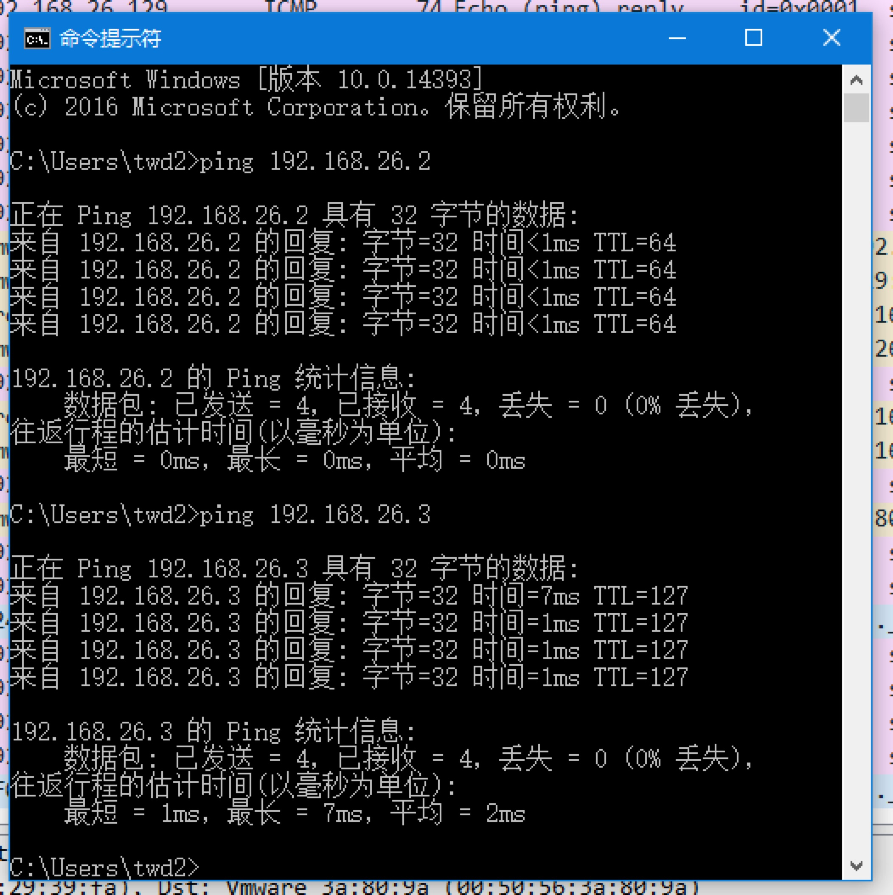

注意到，B 的回复包的 TTL 少了1（初始值为128），这说明回复包经过了某一个路由器，而不是直接从 B 而来。下文分析得知该路由器实际上为网关。从 A 上抓包，得到如下流量：

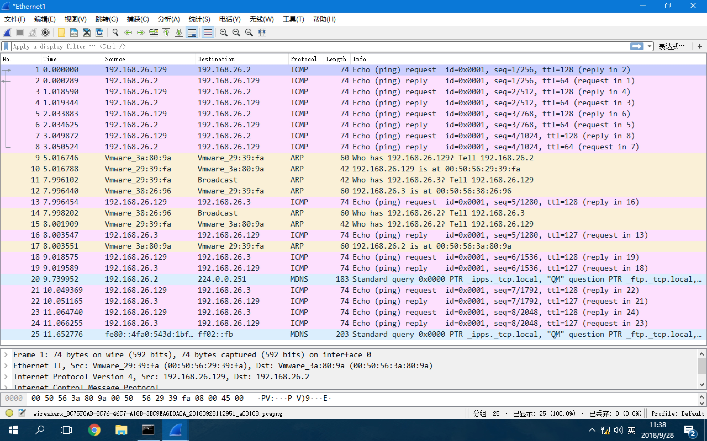

上半部分是正常的与网关的 ICMP 对话，下半部分是 ping B。可以看到，在 A 看来，除了 TTL 减少了以外并没有任何异样。

在 B 上抓包，得到如下流量：

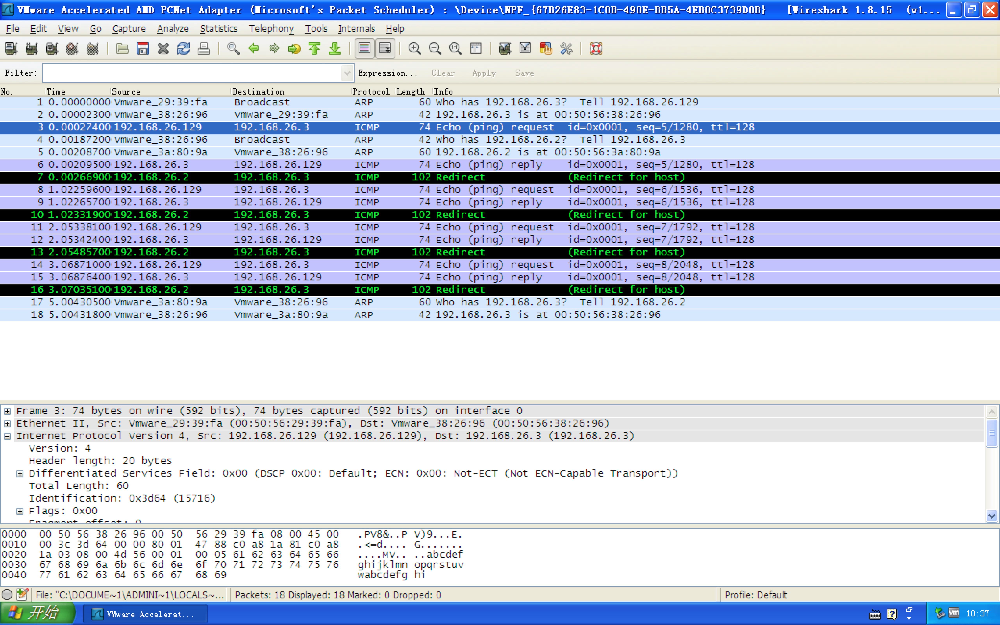

可以看到 B 按照配置，将回复包发送给了网关。网关发现这些包的出入网络接口是相同的（并无法意识到 B 的错误配置），向 B 发送了 `ICMP Redirect` 包，提醒 B 有到 A 更短的路径。

最后的图片说明了网关上观察到的流量：

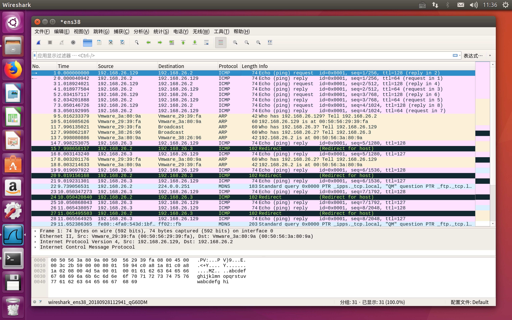

可以看到 A 的请求包没有经过网关，而 B 的回复包确实经过了网关，由于没有开启混杂模式，这证明了上述分析是正确的。

### 连通性测试：从 B

在网关开启的情况下，从 B 分别 ping 网关与 A，都能联通。如图所示：

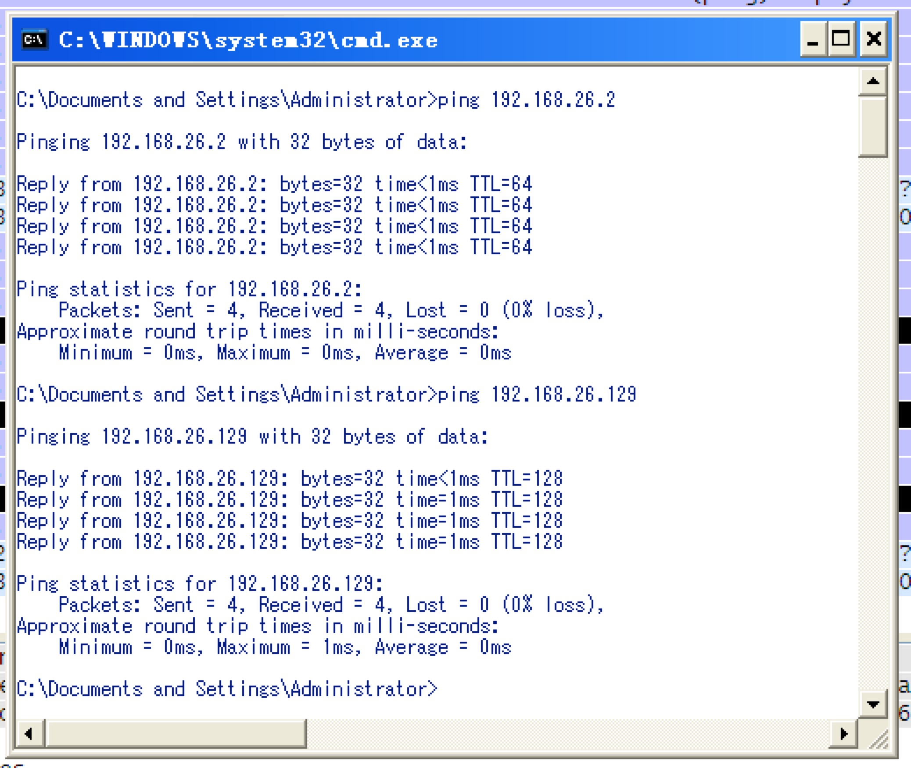

观察回复包的 TTL，可以看出网关与 A 都是直接从链路回复了 B。

在 A 上抓包，能看到从 B 发来的请求包的 TTL 减少了1，这说明请求包经过了某一个路由器（同样为网关），如下图所示：

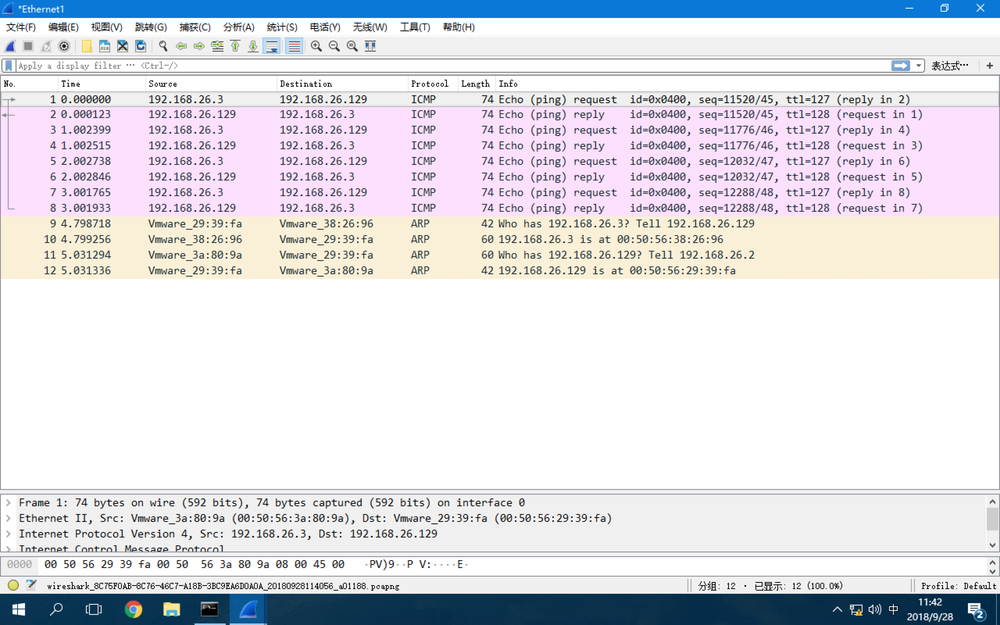

在 B 上抓包，观察如下：

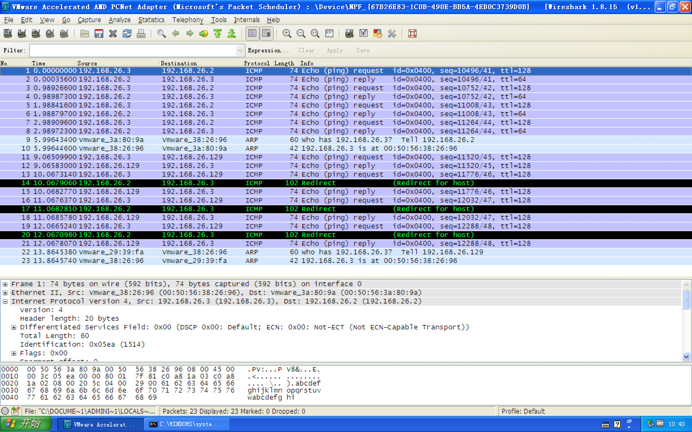

这也是与理论分析相一致的结果：B 与网关是直连的，而 B 到 A 的 ICMP 包发送给了网关（截图中被选中包的目标 MAC 地址即为网关），而回复包直接由 A 从链路上发来。这里网关依旧给 B 发送了 `ICMP Redirect` 的提醒。

类似地，最后的图片说明了网关上观察到的流量：

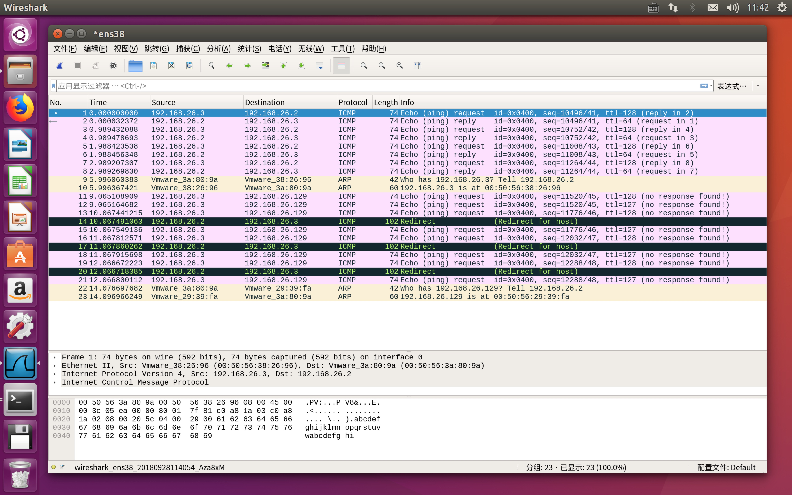

可以看到 B 的请求包确实经过了网关，而 A 的回复包没有经过网关，由于没有开启混杂模式，这证明了上述分析是正确的。

### 连通性测试：网关关闭

在网关关闭的情况下，A 与 B 之间互相均不能 ping 通，根本原因是 B 无法与 A 直接在链路上通信。

如 ping 是 A 发起的，在 B 上可以观察到请求包，但是 B 由于无法得到网关的 ARP 回应，所以无法发出回复包，如图：


如 ping 是 B 发起的，则 B 根本无法发出 ICMP 包，只是不停进行 ARP 询问，在 A 与 B 上都能抓到 B 询问网关 MAC 的 ARP 广播包，如图所示：

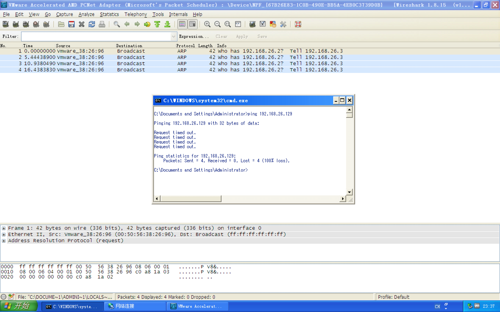

### 说明与总结

本实验中的 ARP 流量都是正常的，即 A 和网关由于正确配置了掩码，它们都会对同一子网的 IP 地址直接发送 ARP 询问以进行直接的链路通信。B 能回复它们的询问，但由于其认为自己与 A 并不在同一个子网中，故其不会主动询问 A 的 MAC 地址，而是选择询问网关 MAC 地址后将发送给 A 的包交给网关处理。在网关的帮助下，A 与 B 能够进行通信，这种通信经过了路由。

## 问题2

### 实验环境

本实验在开放的清华大学无线校园网环境下进行，计算机配置请见下表，均为物理计算机：

| 名称   | 真实 MAC 地址     | IP             | 系统             |
| ------ | ----------------- | -------------- | ---------------- |
| 受害者 | 9c:b6:d0:e3:ae:57 | 183.172.121.74 | Windows 10       |
| 攻击者 | a4:5e:60:f2:4e:57 | 无关           | Mac OS X 10.11.6 |

受害者的网络环境如图：

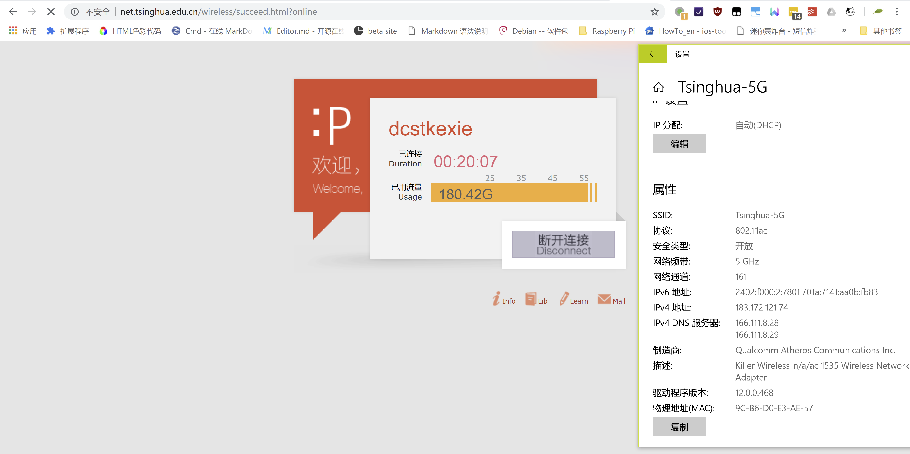

可以看出受害者登录了无线校园网，用户名为 `dcstkexie`。

### 实验过程

#### 获得受害者 MAC 地址

攻击者在连接了同一个开放的无线网络（这是为了将无线网卡的工作频率调到和受害者一致）后，启用无线网卡的监控模式抓包，就能立刻探测到受害者的流量（本例中，受害者被观察到正从清华大学开源软件镜像站下载一个文件，因此有大量的流量，从而容易被发现）。如图所示：

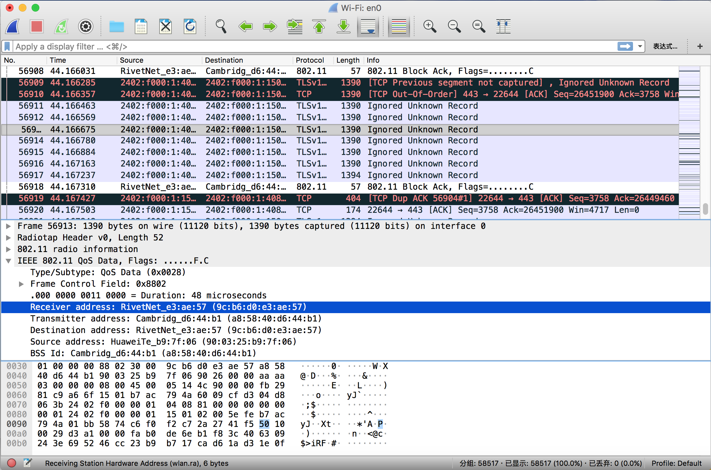

图中选中的数据包就是无线接入点给受害者发送的一个 HTTPS 数据包。这实际上是一个 ISATAP 包（IPv6 in IPv4），因此能看到受害者的 IPv4 地址，同时在 IEEE 802.11 帧内也能看到受害者的接收机 MAC 地址（Receiver Address）与目标 MAC 地址（Destination Address）相同，另外还有源 MAC 地址（Source Address，为网关的 MAC 地址），以及发射机的 MAC 地址（Transmitter Address，为无线接入点的 MAC 地址）。

事实上，通过监控模式就可以捕捉受害者与无线接入点的所有流量，不需要伪装也能完成，这是由于开放的无线网络没有任何加密，因此是非常不安全的。

#### MAC 地址伪装

攻击者获得受害者 MAC 地址后，通过如下命令即可将自己的 MAC 改成受害者的 MAC 地址。

```bash
sudo ifconfig en0 ether 9c:b6:d0:e3:ae:57
```

重新连接网络后，由于清华大学无线校园网配置了 DHCP Snooping，这里不设置静态 IP 地址，而是使用 DHCP 来获得地址。由于 MAC 地址相同，DHCP 服务器倾向于提供相同的动态 IP 地址。

然后访问校园网登录页面，如图所示：

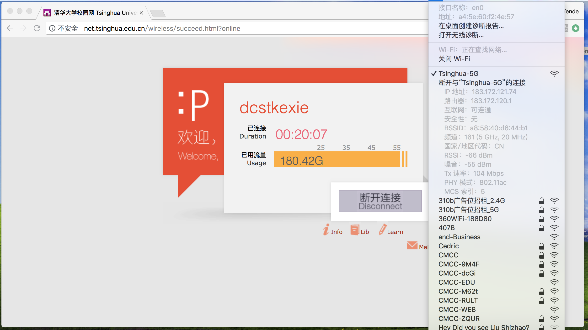

攻击者成功获得了相同的 IP 地址，并且登录页面显示已登录了同样的账号。此时即使关闭监控模式，也能接收到无线接入点发送给受害者的流量。同时，由于无线接入点和无线控制器事实上已经无法区分攻击者和受害者，受害者也不会观察到网络连接断开。

注：图中第二行的 MAC 地址是硬件的原始 MAC 地址，实际上已经通过上面的命令修改了其使用的 MAC 地址。

### 实验结果

在完成攻击后，攻击者即能够盗取受害者的身份，伪装成受害者与外界进行通信，正如上图中成功地访问了校园网认证页面。但是此途径并不是完美的，根本原因是此时两台设备都能收到很多不属于自己的包，而导致 TCP 等连接状态的错乱，不停产生重传与重置等现象，表现为受害者的下载速度大幅下降甚至下载连接断开，ping 操作的延时也飘忽不定并经常失败。一些 IPv4 流量如下（都从受害者端捕捉，攻击者端是类似的，由于篇幅限制，这里不再赘述）：

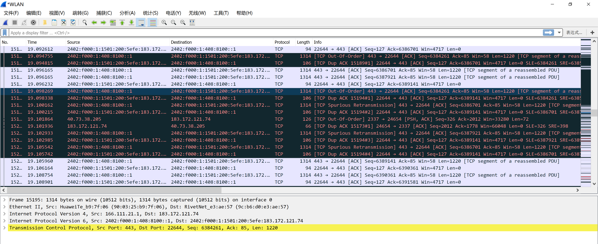

注：图中 IPv6 流量实际上是 ISATAP 隧道，最终还是 IPv4 流量。

一些非正常流量如下图所示。

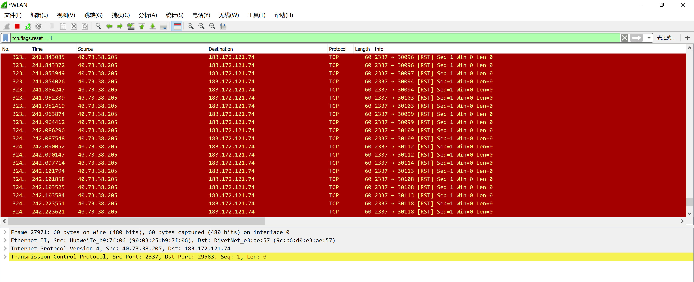

远端服务器因为无法理解流量（可能是攻击者的系统由于无法识别这样的连接而发起了连接的重置），中断了与受害者的正常通信。

对于 IPv6，由于 IPv6 的邻居发现协议（对应 IPv4 的 ARP），通信最后依旧对 MAC 地址有很强的依赖。所以在二者 MAC 相同的情况下，即使两台机器因为 Privacy Extension 的原因具有不同的全球单播地址（本实验中为 `2402:f000::/32`），它们也无法正常地访问网络。

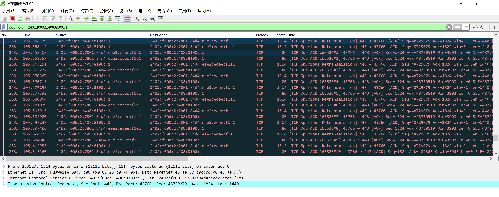

可以看到此图中甚至对一个数据包进行了几乎十次确认与重传。

### 加密情况

我们使用一个使用预共享密钥的 WPA 2 加密的无线网络也进行了类似的测试（假设攻击者能够连接到网络）。首先，我们无法再通过嗅探流量得到受害者的 IP 地址（因为帧都是加密的），但是仍然可以获得受害者的 MAC 地址。而一旦攻击者以相同的 MAC 连接到网络，受害者与无线接入点的通信就完全得不到回应；而受害者重新连接以后，攻击者也能观察到类似的现象。如果我们使两者分别关联不同的无线接入点，在无线控制器上观察，攻击过程表现就像是一个客户端在两个无线接入点之间进行了一次漫游。这是由于，在加密的无线网络的情况下，每次客户端关联到无线接入点时，无线控制器都会与客户端协商一个新的会话密钥，因此前一个连接者自然无法继续通信，后到者总是能够“抢占”网络。

### 结论

使用开放的无线网络是十分危险的行为，除了明文流量容易被监听外，也容易受到伪装等攻击。因此，用户应当尽量避免连接到这样的网络，否则需要使用 VPN 等手段自行加密自己的流量。加密的无线网络虽然无法被直接监听，但如果是预共享密钥网络，也无法避免密钥泄露导致的一系列攻击，需要额外的机制（类似 802.1X 这样的每客户端验证）来预防。